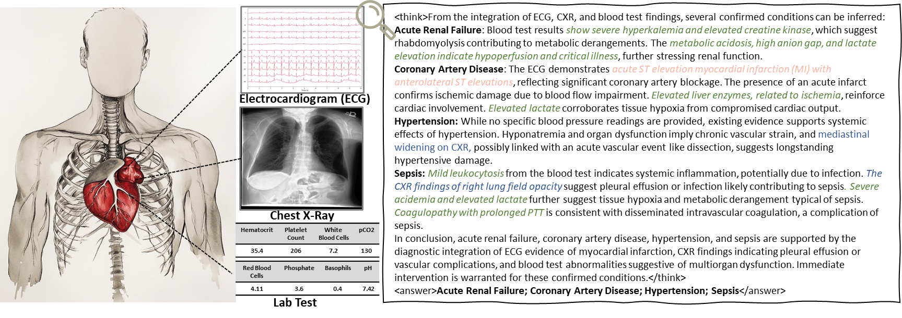
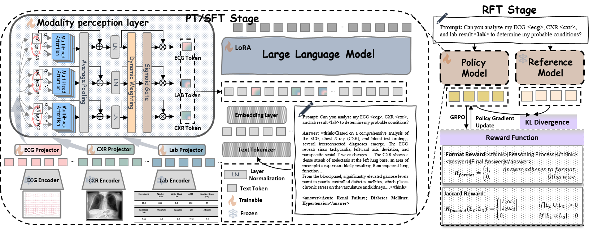
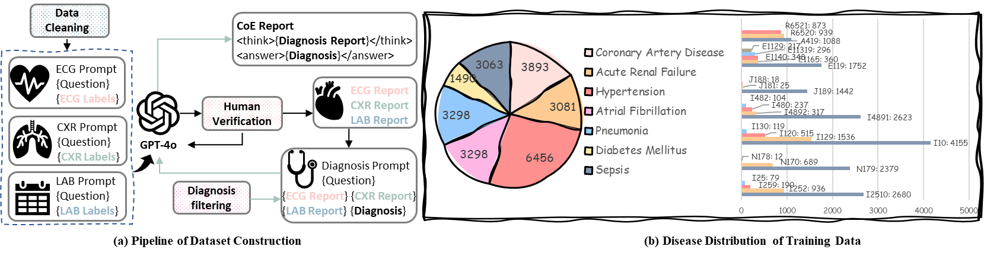

# 🌟MedTVT-R1: A Multimodal LLM Empowering Medical Reasoning and Diagnosis


## 📖 Introduction 

MedTVT-R1 is a multimodal large language model (LLM) designed to enhance medical reasoning and diagnosis by integrating Electrocardiogram (Time Series), Chest X-ray (Visual Image), and Blood Test (Tabular Data). The model combines advanced modality-aware layers and reinforcement fine-tuning techniques to deliver improved diagnostic interpretability and accuracy.

 

## 📝 Abstract 

Accurate and interpretable multi-disease diagnosis remains a critical challenge in medical research, particularly when leveraging heterogeneous multimodal medical data. Current approaches often rely on single-modal data, limiting their ability to comprehensively understand complex diseases. To address this, we propose MedTVT-R1, a novel Multimodal Large Language Model (MLLM) framework designed to integrate clinical multimodal data for reasoning and diagnosing multiple diseases. We construct MedTVT-QA, a curated instruction dataset that provides question-answer pairs for physiological-level interpretations and disease-level diagnoses with a Chain of Evidence approach. MedTVT-R1 incorporates a modality perception layer to capture inter-modal dependencies and adaptively weight modality contributions. Additionally, we employ Group Relative Policy Optimization (GRPO)-based Reinforcement Fine-Tuning with a Jaccard Reward function to enhance diagnostic reasoning. Experimental results demonstrate MedTVT-R1’s superiority in multimodal feature utilization and multi-disease diagnosis, offering significant potential for clinical applications such as diagnostic report generation and comorbidity reasoning.



## 📂 Data Preparation 

- Download the MIMIC-IV-ECG and MIMIC-IV-CXR datasets from the PhysioNet website and store them in the `./Dataset` 
  - 📥[MIMIC-IV-ECG](https://physionet.org/content/mimic-iv-ecg/1.0/)
  - 📥[MIMIC-CXR-JPG](https://physionet.org/content/mimic-cxr-jpg/2.1.0/)
- Download our preprocessed MedTVT-QA dataset and store it in the `./QA` .
  - 📥[MedTVT-QA Dataset](https://huggingface.co/datasets/kekeYeah/MedTVT-QA/tree/main)
  - 
- Download the pretrained weights for the ECG encoder and lab encoder from Huggingface and store them in the `./CKPTS` .
  - 📥[Pretrained Weights](https://huggingface.co/kekeYeah/Checkpoints/upload/main)
- Download the original version of the LLaMA3.2-1B pretrained weights and store them in the `./CKPTS/LLaMA3.2-1B-Instruct`.
  - 📥[LLaMA3.2-1B Pretrained Weights](https://huggingface.co/meta-llama/Llama-3.2-1B/tree/main/original)

## 🚀 Environment Setup 

Create and activate a new Anaconda environment using the following commands:

```bash
conda create --name MedTVT-R1 python==3.9.17
conda activate MedTVT-R1
pip install -r requirements.txt
cd MedTVT-R1
```

## 💪 Pre-training Phase (PT)  

Run the following command to start the pre-training phase:

```bash
bash PT.sh
```

## 🔧 Supervised Fine-tuning Phase (SFT) 

Run the following command to start the supervised fine-tuning phase:

```bash
bash SFT.sh
```

## 🎯 Reinforcement Fine-tuning Phase (RFT) 

Run the following command to start the reinforcement learning fine-tuning phase:

```bash
bash RFT.sh
```

## 📚 Citation 

If you use MedTVT-R1 in your research, please cite our paper:

```
@article{zhang2025medtvt,
  title={MedTVT-R1: A Multimodal LLM Empowering Medical Reasoning and Diagnosis},
  author={Zhang, Yuting},
  journal={Preprint, under review},
  year={2025}
}
```


